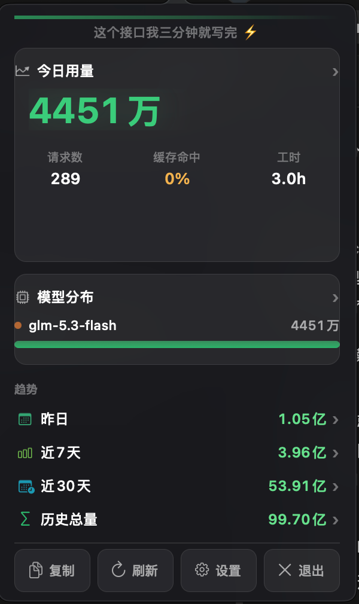
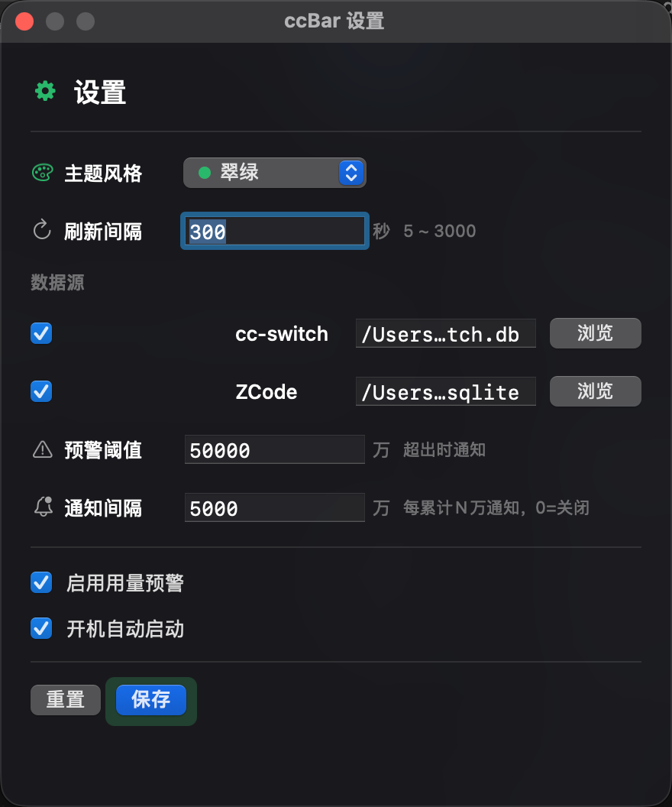
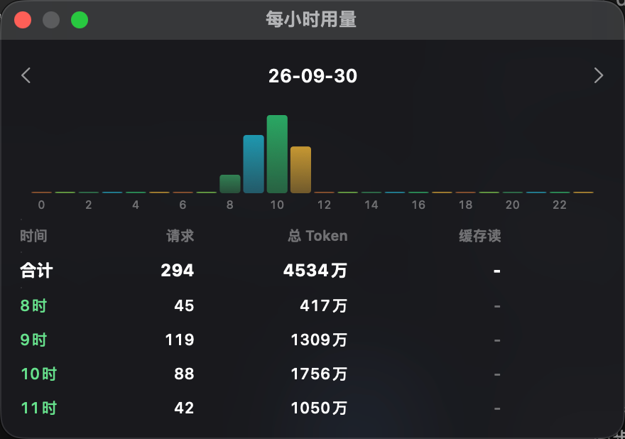

# CCBar

macOS 菜单栏 AI CLI 用量统计工具。实时显示今日 token 消耗，支持**多数据源**聚合——目前内置 [cc-switch](https://github.com/farion1231/cc-switch)（Claude/Codex 等多应用代理统计）与 ZCode，后续可插拔扩展。

 
  

<p align="center">
  
  <br/>
  
  
  <br/>
  
</p>

## English

CCBar is a native macOS menu bar app that tracks your AI CLI token usage in real time — today, this week, and all-time — with **pluggable data sources**: [cc-switch](https://github.com/farion1231/cc-switch) (Claude Code / Codex / OpenCode via proxy) and ZCode (GLM). History is synced daily into a local SQLite store (source databases are opened read-only and never modified), while today's numbers are queried live. A five-page insights center (cost / insights / share / channels / timeline) with a model chronicle, a shareable usage card with QR code, and an auto-generated weekly report (saved every Monday, backfilled if the Mac was off) are built in, along with milestone notifications, quota warnings, per-channel breakdowns, idempotent CSV export/import, a running pixel cat in the menu bar, six built-in themes plus importable JSON theme packs, bilingual UI (中文 / English), daily auto-backups with 7-copy rotation, and a drag-to-install DMG. A Windows system tray version lives in [ccbar-win](https://github.com/bmfish/ccbar-win).

## 功能

- **菜单栏实时用量**：标题栏直接显示今日 token 总量，按用量阈值变色，每 30 秒（可调）刷新
- **动画伴侣**：像素小猫住在菜单栏，没用量睡觉、用量越大跑得越快（可关，换回闪电 LED 图标）
- **用量预警 / 里程碑**：超过阈值或每累计 N 万 token 弹出系统通知，陪你刷量 🫧
- **弹窗面板**：今日卡片（请求数 / 缓存命中率 / 工时）、模型分布、趋势（昨日 / 近7天 / 近30天 / 历史总量）、速率预测
- **详情窗口**：近 7 天、近 30 天（柱状图拖选读数）、模型分布（环形图 + 按渠道分组明细）、每小时分布，全部支持 CSV 导出
- **洞察中心**：费用（走势 / 模型费用排行 / 性价比榜）、洞察（连续天数 / 周环比 / 90 天热力图 / **模型编年史** / 月度预测）、渠道（堆叠趋势 / 应用分布 / Token 构成 / 缓存命中率）、流水（今日逐笔，可按渠道 / 模型筛选）等板块
- **周报 + 战报分享**：每周一自动生成上周用量周报 PNG 到 `~/Documents/CCBar 周报/`（周一没开机，下次启动自动补），分享页实时预览周报卡和带二维码的今日战报卡，保存 / 复制一键分享
- **多数据源**：每个源可独立启用 / 停用、自定义数据库路径、保存前即时校验
- **主题 + 主题包**：6 套内置配色（含 CRT 终端），JSON 主题包一键导入 / 导出，方便社区分享
- **双语界面**：中文 / English / 跟随系统
- **数据安全**：每天自动备份统计库（滚动保留 7 份），也可一键手动备份；明细 CSV 幂等导入导出（主键去重，重复导入零新增），换机 / 多机合并不重不漏；手动 + 静默检查更新
- **拖拽即装**：DMG 自带 Applications 快捷方式

## 数据架构

ccbar 自带一个统计库（`~/Library/Application Support/ccbar/ccbar.db`），对外部源库**全程只读**：

```
自建库（主连接）
 ├── usage_log   统一明细表（昨天及更早的历史，每日懒惰补账同步进来）
 ├── daily_agg   每日聚合缓存（区间/总量/按月查询直接读它，补账时同步维护）
 ├── meta        各源同步水位
 └── usage_all   视图 = 自家历史 + 各启用源"今日"实时数据
      ├── ATTACH ~/.cc-switch/cc-switch.db   (只读)
      └── ATTACH ~/.zcode/cli/db/db.sqlite   (只读)
```

- **历史**（昨天及更早）：每天首次刷新时自动补账进自家库，源库清理不影响已有统计
- **今日**：每次刷新实时查各源库汇总，零延迟
- 两段在 `usage_all` 视图中拼接，查询侧不区分数据来自哪一路

### 统计口径

| 数据源 | 口径 | 说明 |
|---|---|---|
| cc-switch | input + output + 缓存读 + 缓存创建 | 全量 token 流量，费用按 cc-switch 记录的单价折算 |
| ZCode | input + output | 与 ZCode 官方统计一致（`computed_total_tokens`），缓存命中不计入，可直接与 ZCode 界面对账 |

## 添加新数据源

实现 `SourceAdapter` 协议并注册一行即可，同步、视图、设置 UI 自动生效：

```swift
struct MyAdapter: SourceAdapter {
    let id = "myapp"
    let name = "MyApp"
    let defaultPath = "\(NSHomeDirectory())/.myapp/stats.db"
    let alias = "src_my"
    let requiredTables = ["requests"]

    func attachSQL(fileURL: String) -> String { "ATTACH DATABASE 'file:\(fileURL)?mode=ro' AS \(alias)" }
    func syncSQLs(alias: String, fromEpoch: Int64, todayEpoch: Int64) -> [String] { /* INSERT OR IGNORE INTO usage_log ... */ }
    func todayFragment(alias: String, todayStartEpoch: Int64) -> String { /* usage_all 的"今日"UNION 段 */ }
}

// SourceRegistry.adapters 中注册
```

## 构建

```bash
# 一键构建 + 组装 app + 打 DMG（版本号取 git tag，可用参数覆盖）
scripts/package.sh

# 出 arm64 + x86_64 双架构包
scripts/package.sh --universal

# 发布：push tag 后 GitHub Actions 自动构建 universal DMG 并发 Release
git tag v1.2.0 && git push origin v1.2.0
```

手动构建等价于：

```bash
swift build -c release
cp .build/release/CCBar CCBar.app/Contents/MacOS/CCBar
codesign --force --deep -s - CCBar.app
```

> 通知说明：用量预警 / 里程碑使用系统通知（UNUserNotificationCenter），首次启动会请求通知权限；拒绝后不影响统计，仅收不到提醒。

## 版本

- **v1.6.x** — 洞察中心（费用 / 洞察 / 分享 / 渠道 / 流水五页）、模型编年史、用量周报每周一自动生成（错过补账）+ 周报卡内嵌分享页、战报 / 周报卡带 GitHub 二维码、明细 CSV 幂等导入导出、界面中英双语、主题重命名 / 删除、Token 轴统一亿 / 万口径、热力图色阶丰富
- **v1.4.0** — UI 代际升级：弹窗与详情窗口全面迁移 SwiftUI + Swift Charts（拖选读数）、菜单栏/弹窗数字滚动动画、柱状图随机配色、宽版弹窗、菜单栏 hover 摘要、通知点击路由、设置内检查更新；最低系统 macOS 13
- **v1.3.0** — 新增每日聚合缓存表（总量查询约 45×提速），详情窗口/按月汇总不再扫明细；CI 增加测试流水线（push/PR 跑 swift test），发布流程先测试后打包
- **v1.2.1** — 界面打磨：菜单栏右键快捷菜单 + 小图标、标题颜色按预警阈值渐变、新增"历史总量"（按月汇总）窗口、详情窗口记住位置、CSV 导出、弹窗 ESC 关闭/按钮栏钉底/数据签名去重不闪烁、设置页路径即时校验与保存校验、图表 hover 数值、可访问性基础支持
- **v1.2.0** — 查询全面走索引区间（今日查询约 50×提速）、通知迁移 UNUserNotificationCenter（点通知打开面板）、开机启动接入 SMAppService、修复 +8 时区下"今日"边界偏移 8 小时的口径问题、查询/同步移至后台队列、设置页显示数据源连接状态、打包脚本 + GitHub Actions 自动发布、新增单元测试
- **v1.1.0** — 多数据源统计架构：自建统计库 + ZCode 接入（官方口径）、模型分布按渠道分组、亮色背景可读性修复
- **v1.0.0** — 多主题系统、柱状图、通知间隔、滚动支持
